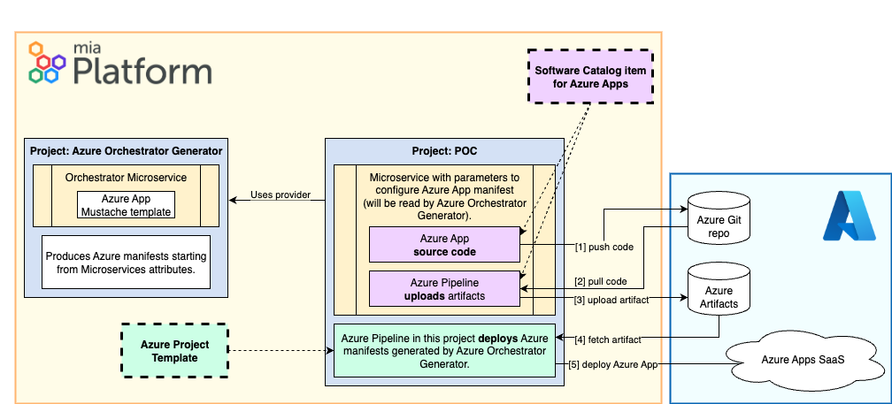

# 🚧 Azure WebApp Project Template DRAFT
💡 This project blueprint can be used to demonstrate how to manage an Azure WebApp seamlessly within the Console. This is the overall architecture of the solution.



⚠️ **This project blueprint is a DRAFT and simplified example only!** ⚠️
 - The provided pipeline contains hardcoded `templateDirectory` assuming only `DEV` environment exists.
 - The provided pipeline has been tested only on a **specific use case** and has hardcoded references and names (e.g. `currentAppName`).
 - This project requires a [Custom Orchestrator Generator](#custom-orchestrator-generator) to properly work.
 - This project also requires [microservices that archive generated artifacts in a feed](#requirements-for-microservices) on Azure DevOps.

 📚 **Use this as a learning reference, not for production deployments**

## Pipeline Variables

The Azure DevOps pipeline requires the following variables to be replaced before execution.

| Variable | Description | Example |
|----------|-------------|---------|
| `{{AZURE_SUBSCRIPTION}}` | The name of the Azure service connection configured in Azure DevOps | `MyAzureSubscription` |
| `{{AZURE_SUBSCRIPTION_ID}}` | The Azure subscription ID where resources will be deployed | `12345678-1234-1234-1234-123456789012` |
| `{{AZURE_RESOURCE_GROUP_NAME}}` | The name of the Azure resource group where resources will be deployed | `my-app-rg` |
| `{{AZURE_LOCATION}}` | The Azure region where resources will be deployed | `eastus` |
| `{{AZURE_PACKAGE_FEED_NAME}}` | The name of the Azure Artifacts feed containing the deployment packages | `my-package-feed` |

## Custom Orchestrator Generator
The Orchestrator should replace values in a template similar to the following:
```json
{
    "$schema": "https://schema.management.azure.com/schemas/2019-04-01/deploymentTemplate.json#",
    "contentVersion": "1.0.0.0",
    "parameters": {
        "appName": {
            "type": "string",
            "metadata": {
                "description": "The globally unique name of the web app."
            },
            "defaultValue": "{{serviceName}}"
        },
        "location": {
            "type": "string",
            "metadata": {
                "description": "The location for the resources, defaults to the resource group's location."
            },
            "defaultValue": "{{serviceParameters.location}}"
        }
    },
    "resources": [
        {
            "type": "Microsoft.Web/serverfarms",
            "apiVersion": "2022-03-01",
            "name": "{{serviceParameters.appServicePlanName}}",
            "location": "[parameters('location')]",
            "sku": {
                "name": "{{serviceParameters.sku}}"
            },
            "kind": "linux",
            "properties": {
                "reserved": true
            }
        },
        {
            "type": "{{serviceParameters.type}}",
            "apiVersion": "2022-03-01",
            "name": "[parameters('appName')]",
            "location": "[parameters('location')]",
            "kind": "{{serviceParameters.kind}}",
            "dependsOn": {{{serviceParameters.dependsOn}}},
            "properties": {
                "serverFarmId": "[resourceId('Microsoft.Web/serverfarms', '{{serviceParameters.appServicePlanName}}')]",
                "siteConfig": {
                    "linuxFxVersion": "{{serviceParameters.linuxFxVersion}}",
                    "appCommandLine": "{{serviceParameters.appCommandLine}}"
                }
            }
        }
    ]
}
```

It is expected that microservices in this projects provide the following values in the annotations:
| Key | Description | Example |
| --- | --- | --- |
| sku | The SKU for the App Service Plan (e.g., F1 for Free, B1 for Basic, S1 for Standard) | F1 |
| location | The location for the resources, defaults to the resource group's location | [resourceGroup().location] |
| type | Resource type | Microsoft.Web/sites |
| kind | app: Standard web app<br>functionapp: Azure Functions<br>linux: Linux-based App Service<br>windows: Windows-based App Service<br>elastic: Scaling out across instances<br>webworker: Background worker processes | app,linux |
| dependsOn | Array of dependencies | ["[resourceId('Microsoft.Web/serverfarms', 'ASP-miademo')]"] |
| appServicePlanName | You need to include a Microsoft.Web/serverfarms resource in your resources array. | ASP-miademo |
| linuxFxVersion | Linux version for the App | NODE\|18-lts |
| appCommandLine | Startup command line | npm start |

## Requirements for microservices
This project requires microservices that archive generated artifacts in a feed on Azure DevOps to work, as the project pipeline will search them in the feed.

This is a sample pipeline doing so for a Node microservice:
```yaml
# This pipeline builds the Node.js application and publishes it as an artifact.
trigger:
- master # Triggers on changes to the master branch

pool:
  vmImage: 'ubuntu-latest'

steps:
- task: NodeTool@0
  inputs:
    versionSpec: '18.x'
  displayName: 'Install Node.js'

- script: |
    npm install
  displayName: 'Install Dependencies'

- script: |
    chmod +x test.sh
    ./test.sh
  displayName: 'Run Tests'

# Create a clean folder with only the necessary app files for deployment
- task: CopyFiles@2
  inputs:
    SourceFolder: '$(System.DefaultWorkingDirectory)'
    Contents: |
      src/**
      node_modules/**
      package.json
      package-lock.json
    TargetFolder: '$(Build.ArtifactStagingDirectory)/app'
  displayName: 'Copy files to staging directory'

- task: ArchiveFiles@2
  inputs:
    rootFolderOrFile: '$(Build.ArtifactStagingDirectory)/app' # Zip the clean staging folder
    includeRootFolder: false
    archiveType: 'zip'
    # The artifact will be named 'app.zip' and placed in the artifact staging directory
    archiveFile: '$(Build.ArtifactStagingDirectory)/app.zip'
    replaceExistingArchive: true
  displayName: 'Archive source code'

- task: PublishPipelineArtifact@1
  inputs:
    targetPath: '$(Build.ArtifactStagingDirectory)/app.zip'
    # The artifact is named 'drop'. The CD pipeline will refer to this name.
    artifact: 'drop'
    publishLocation: 'pipeline'
  displayName: 'Publish Artifact'
```