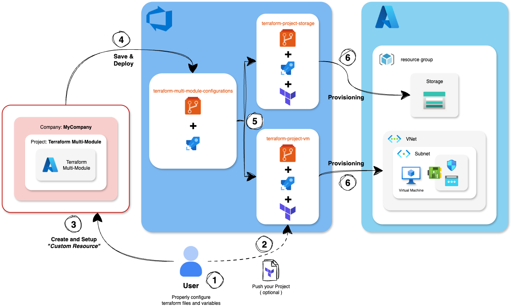

# 🚧 Terraform Manager Project Template DRAFT
💡 This project blueprint can be used to demonstrate how to manage a multi-module Terraform project seamlessly within the Console. This is the overall architecture of the solution.



⚠️ **This project blueprint is a DRAFT and simplified example only!** ⚠️
 - The provided pipeline has been tested only on a **specific use case** and may have hardcoded references and names.

 📚 **Use this as a learning reference, not for production deployments**

## Pipeline Variables

The Azure DevOps pipeline requires the following variables to be replaced before execution.

| Variable | Description | Example |
|----------|-------------|---------|
| `VARIABLES_GROUP_NAME` | The name of the Azure DevOps variable group containing environment secrets and configuration | `terraform-manager-dev-vars` |
| `DEVOPS_TRIGGER_USER` | The Azure DevOps username or service account used to trigger the pipeline | `myuser@domain.com` |
| `DEVOPS_TRIGGER_PRIVATE_ACCESS_TOKEN` | The Azure DevOps Personal Access Token (PAT) for authentication | `abcdef1234567890` |

## Sample assets
To setup this solution you need to have some Infrastructure Components configured in the Software Catalog, and some existing Terraform repositories. Following, some sample definitions.

### Azure Storage 
Asset descriptor for Software Marketplace item related to Azure Storage. The `terraformProjectId` parameter must reference an existing Terraform project on Azure DevOps: that will be the repository where the Terraform scripts to be executed are committed. That pipeline will be executed with the generated Terraform variables.
```json
{
  "generator": {
    "configurationBaseFolder": "terraform-azure-manager",
    "templates": [
      {
        "fileExtension": "tf",
        "name": "variables",
        "template": "variable \"account_tier\" {\n  description = \"Storage account tier\"\n  type        = string\n  default     = \"%spec.storageAccountTier%\"\n}\n\nvariable \"account_replication_type\" {\n  description = \"Storage account replication type\"\n  type        = string\n  default     = \"%spec.accountReplicationType%\"\n}\n\nvariable \"file_share_quota\" {\n  description = \"File share quota in GB\"\n  type        = number\n  default     = \"%spec.fileShareQuota%\"\n}\n\nvariable \"storage_account_name\" {\n  description = \"Storage account name\"\n  type        = string\n  default     = \"%spec.storageAccountName%\"\n}\n\nvariable \"storage_share_name\" {\n  description = \"Storage share name\"\n  type        = string\n  default     = \"%spec.storageShareName%\"\n}\n"
      },
      {
        "fileExtension": "env",
        "name": "configs",
        "template": "%#spec.terraformAction%\nACTION=%spec.terraformAction%\n%/spec.terraformAction%\n%^spec.terraformAction%\nACTION=apply\n%/spec.terraformAction%\nTERRAFORM_PROJECT_ID=%spec.terraformProjectId%\nAZURE_TENANT_ID=%spec.tenantId%\nAZURE_SUBSCRIPTION_ID=%spec.subscriptionId%\nAUTO_APPROVE=%spec.terraformAutoApprove%\nREPOSITORY_BRANCH_NAME=%spec.terraformProjectReference%\n"
      }
    ],
    "type": "template"
  },
  "meta": {
    "apiVersion": "custom-generator.console.mia-platform.eu/v1",
    "kind": "Terraform"
  },
  "name": "terraform-azure-manager",
  "spec": {
    "subscriptionId": "abcdefgh-1234-1234-1234-abcdefghijkl",
    "tenantId": "abcdefgh-1234-1234-1234-abcdefghijkl",
    "terraformAction": "apply",
    "terraformAutoApprove": true,
    "terraformProjectId": 9999,
    "terraformProjectReference": "Trunk",
    "storageAccountTier": "Standard",
    "accountReplicationType": "LRS",
    "fileShareQuota": 1
  },
  "jsonSchema": {
    "type": "object",
    "additionalProperties": false,
    "properties": {
      "subscriptionId": {
        "type": "string",
        "description": "Azure Subscription ID"
      },
      "tenantId": {
        "type": "string",
        "description": "Azure Tenant ID"
      },
      "terraformAction": {
        "type": "string",
        "enum": [
          "apply",
          "destroy"
        ],
        "default": "apply",
        "description": "Terraform action to perform"
      },
      "terraformAutoApprove": {
        "type": "boolean",
        "default": false,
        "description": "Automatically approve Terraform actions"
      },
      "terraformProjectId": {
        "type": "integer",
        "description": "ID of the Terraform project"
      },
      "terraformProjectReference": {
        "type": "string",
        "description": "Reference branch for the Terraform project",
        "default": "main"
      },
      "storageAccountTier": {
        "type": "string",
        "enum": [
          "Standard",
          "Premium"
        ],
        "default": "Standard",
        "description": "Storage account tier"
      },
      "accountReplicationType": {
        "type": "string",
        "enum": [
          "LRS",
          "GRS",
          "RAGRS",
          "ZRS",
          "GZRS",
          "RAGZRS"
        ],
        "default": "LRS",
        "description": "Storage account replication type"
      },
      "fileShareQuota": {
        "type": "number",
        "enum": [
          1,
          20,
          100
        ],
        "default": "1",
        "description": "File share quota in GB"
      },
      "storageAccountName": {
        "type": "string",
        "description": "Storage account name",
        "default": "mycompanypocsharedstorage"
      },
      "storageShareName": {
        "type": "string",
        "description": "Storage share name",
        "default": "mycompany-poc-file-share"
      }
    },
    "required": [
      "subscriptionId",
      "tenantId",
      "terraformAction",
      "terraformAutoApprove",
      "terraformProjectId",
      "terraformProjectReference",
      "storageAccountTier",
      "accountReplicationType",
      "fileShareQuota",
      "storageAccountName",
      "storageShareName"
    ]
  }
}
```

[Here](../attachments/teraform-project-storage/), a sample Terraform repository for Azure VM.

### Azure VM
Asset descriptor for Software Marketplace item related to Azure VM. The `terraformProjectId` parameter must reference an existing Terraform project on Azure DevOps: that will be the repository where the Terraform scripts to be executed are committed. That pipeline will be executed with the generated Terraform variables.
```json
{
  "generator": {
    "configurationBaseFolder": "terraform-azure-manager",
    "templates": [
      {
        "fileExtension": "tf",
        "name": "variables",
        "template": "variable \"storage_account_type\" {\n  description = \"Storage Account Type\"\n  type = string\n  default = \"%spec.storageAccountType%\"\n}\nvariable \"vm_size\" {\n  description = \"The Virtual Machine Size\"\n  type = string\n  default = \"%spec.vmSize%\"\n}\nvariable \"image_offer\" {\n  description = \"The VM Image offer\"\n  type = string\n  default = \"%spec.imageOffer%\"\n}\nvariable \"image_publisher\" {\n  description = \"The VM Image publisher\"\n  type = string\n  default = \"%spec.imagePublisher%\"\n}\nvariable \"image_sku\" {\n  description = \"The VM Image SKU\"\n  type = string\n  default = \"%spec.imageSku%\"\n}\nvariable \"image_version\" {\n  description = \"The VM Image version\"\n  type = string\n  default = \"%spec.imageVersion%\"\n}\n"
      },
      {
        "fileExtension": "env",
        "name": "configs",
        "template": "%#spec.terraformAction%\nACTION=%spec.terraformAction%\n%/spec.terraformAction%\n%^spec.terraformAction%\nACTION=apply\n%/spec.terraformAction%\nTERRAFORM_PROJECT_ID=%spec.terraformProjectId%\nAZURE_TENANT_ID=%spec.tenantId%\nAZURE_SUBSCRIPTION_ID=%spec.subscriptionId%\nAUTO_APPROVE=%spec.terraformAutoApprove%\nREPOSITORY_BRANCH_NAME=%spec.terraformProjectReference%\n"
      }
    ],
    "type": "template"
  },
  "meta": {
    "apiVersion": "custom-generator.console.mia-platform.eu/v1",
    "kind": "Terraform"
  },
  "name": "terraform-azure-manager",
  "spec": {
    "subscriptionId": "abcdefgh-1234-1234-1234-abcdefghijkl",
    "tenantId": "abcdefgh-1234-1234-1234-abcdefghijkl",
    "terraformAction": "apply",
    "terraformAutoApprove": true,
    "terraformProjectId": 9999,
    "terraformProjectReference": "Trunk",
    "storageAccountType": "Premium_LRS",
    "vmSize": "Standard_B1ms",
    "imageOffer": "0001-com-ubuntu-server-jammy",
    "imagePublisher": "Canonical",
    "imageSku": "22_04-lts-gen2",
    "imageVersion": "latest"
  },
  "jsonSchema": {
    "type": "object",
    "additionalProperties": false,
    "properties": {
      "subscriptionId": {
        "type": "string",
        "description": "Azure Subscription ID"
      },
      "tenantId": {
        "type": "string",
        "description": "Azure Tenant ID"
      },
      "terraformAction": {
        "type": "string",
        "enum": [
          "apply",
          "destroy"
        ],
        "default": "apply",
        "description": "Terraform action to perform"
      },
      "terraformAutoApprove": {
        "type": "boolean",
        "default": false,
        "description": "Automatically approve Terraform actions"
      },
      "terraformProjectId": {
        "type": "integer",
        "description": "ID of the Terraform project"
      },
      "terraformProjectReference": {
        "type": "string",
        "description": "Reference branch for the Terraform project",
        "default": "main"
      },
      "storageAccountType": {
        "type": "string",
        "enum": [
          "Standard_LRS",
          "Premium_LRS",
          "Standard_GRS",
          "Standard_RAGRS",
          "Standard_ZRS"
        ],
        "default": "Standard_LRS",
        "description": "Type of Azure Storage Account"
      },
      "vmSize": {
        "type": "string",
        "enum": [
          "Standard_B1s",
          "Standard_B1ms",
          "Standard_B2s",
          "Standard_B2ms",
          "Standard_B4ms",
          "Standard_B8ms",
          "Standard_D2s_v3",
          "Standard_D4s_v3",
          "Standard_D8s_v3",
          "Standard_D16s_v3",
          "Standard_D32s_v3",
          "Standard_D64s_v3"
        ],
        "default": "Standard_B1ms",
        "description": "Size of the Virtual Machine"
      },
      "imageOffer": {
        "type": "string",
        "enum": [
          "0001-com-ubuntu-server-jammy",
          "0001-com-ubuntu-server-focal",
          "0001-com-ubuntu-server-bionic",
          "0001-com-ubuntu-server-xenial",
          "0001-com-ubuntu-server-trusty"
        ],
        "default": "0001-com-ubuntu-server-jammy",
        "description": "Image offer for the Virtual Machine"
      },
      "imagePublisher": {
        "type": "string",
        "enum": [
          "Canonical",
          "MicrosoftWindowsServer",
          "RedHat",
          "SUSE"
        ],
        "default": "Canonical",
        "description": "Image publisher for the Virtual Machine"
      },
      "imageSku": {
        "type": "string",
        "enum": [
          "22_04-lts-gen2",
          "20_04-lts-gen2",
          "18_04-lts-gen2",
          "16_04-lts-gen2",
          "14_04-lts-gen2",
          "22_04-lts",
          "20_04-lts",
          "18_04-lts",
          "16_04-lts",
          "14_04-lts"
        ],
        "default": "22_04-lts-gen2",
        "description": "Image SKU for the Virtual Machine"
      },
      "imageVersion": {
        "type": "string",
        "enum": [
          "latest",
          "2023.10.01",
          "2023.09.01",
          "2023.08.01"
        ],
        "default": "latest",
        "description": "Image version for the Virtual Machine"
      }
    },
    "required": [
      "subscriptionId",
      "tenantId",
      "terraformAction",
      "terraformAutoApprove",
      "terraformProjectId",
      "terraformProjectReference",
      "storageAccountType",
      "vmSize",
      "imageOffer",
      "imagePublisher",
      "imageSku",
      "imageVersion"
    ]
  }
}
```

[Here](../attachments/teraform-project-vm/), a sample Terraform repository for Azure VM.
